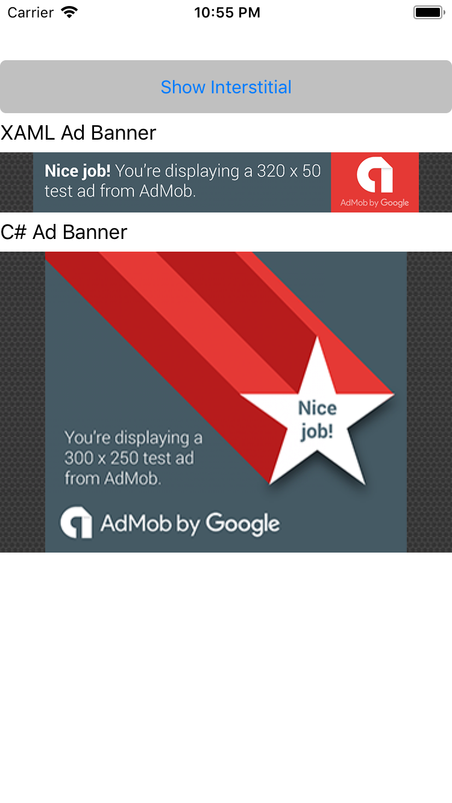
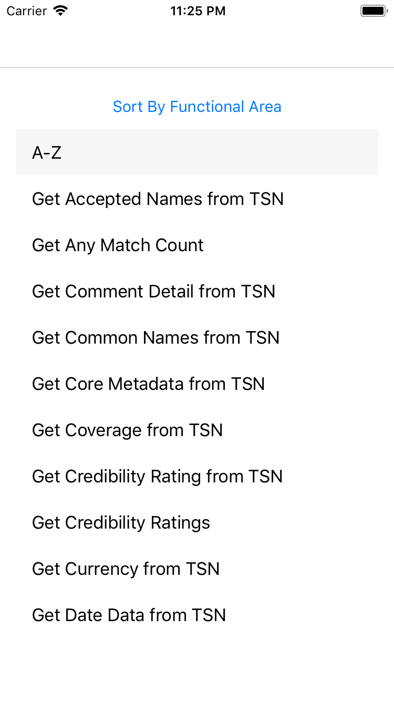
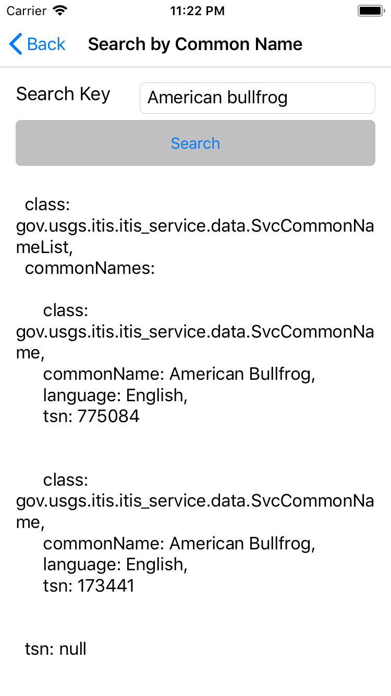

# Xamarin

## Contents
* [Ads](#ads)
* [Taxonomic_Information](#taxonomic_information)

## Ads
This sample Xamarin.Forms project demonstrates how to implement banner ads of different sizes and interstitial ads on iOS, Android and Windows(UWP) apps.

iOS and Android use Google's AdMob as an ad provider while Windows(UWP) uses Microsoft Store Services. 

### How-To
* PCL
    * Implement [`AdBanner.cs`](./Ads/Ads/Ads/AdBanner.cs)
    * Implement [`IAdInterstitial.cs`](./Ads/Ads/Ads/IAdInterstitial.cs)
* Android
    * Install [Xamarin.GooglePlayServices.Ads](https://www.nuget.org/packages/Xamarin.GooglePlayServices.Ads/) nuget
    * Implement [`AdBanner_Droid.cs`](./Ads/Ads/Ads.Droid/AdBanner_Droid.cs)
    * Implement [`IAdInterstitial_Droid.cs`](./Ads/Ads/Ads.Droid/AdInterstitial_Droid.cs)
    * Change AdMob id for real ads
* iOS
    * Install [Xamarin.Firebase.iOS.AdMob](https://www.nuget.org/packages/Xamarin.Firebase.iOS.AdMob/) nuget
    * Implement [`AdBanner_iOS.cs`](./Ads/Ads/Ads.iOS/AdBanner_iOS.cs)
    * Implement [`IAdInterstitial_iOS.cs`](./Ads/Ads/Ads.iOS/AdInterstitial_iOS.cs)
    * Change AdMob id for real ads
* Windows(UWP)
    * Install [Microsoft Store Services](https://docs.microsoft.com/en-us/windows/uwp/monetize/adcontrol-in-xaml-and--net) SDK
    * Implement [`AdBanner_UWP.cs`](./Ads/Ads/Ads.UWP/AdBanner_UWP.cs)
    * Implement [`IAdInterstitial_UWP.cs`](./Ads/Ads/Ads.UWP/AdInterstitial_UWP.cs)
    * Change ApplicationId and AdUnitId id for real ads

#### AdBanner
``` C#
var adBanner = new AdBanner();
adBanner.Size = AdBanner.Sizes.MediumRectangle;
```

```XAML
<?xml version="1.0" encoding="utf-8" ?>
<ContentPage xmlns:Ad="clr-namespace:Ads;assembly=Ads"
             ..>
    <Ad:AdBanner Size="Standardbanner"/>
</ContentPage>
```
#### AdInterstitial
``` C#
IAdInterstitial adInterstitial = DependencyService.Get<IAdInterstitial>();
adInterstitial.ShowAd();
```
 

## Taxonomic_Information
This sample Xamarin.Forms project searches and retrieves data from Integrated Taxonomic Information System (ITIS) by accessing web service APIs provided by ITIS.

All API descriptions and documentation can be accessed [here](https://www.itis.gov/ws_description.html)

  
